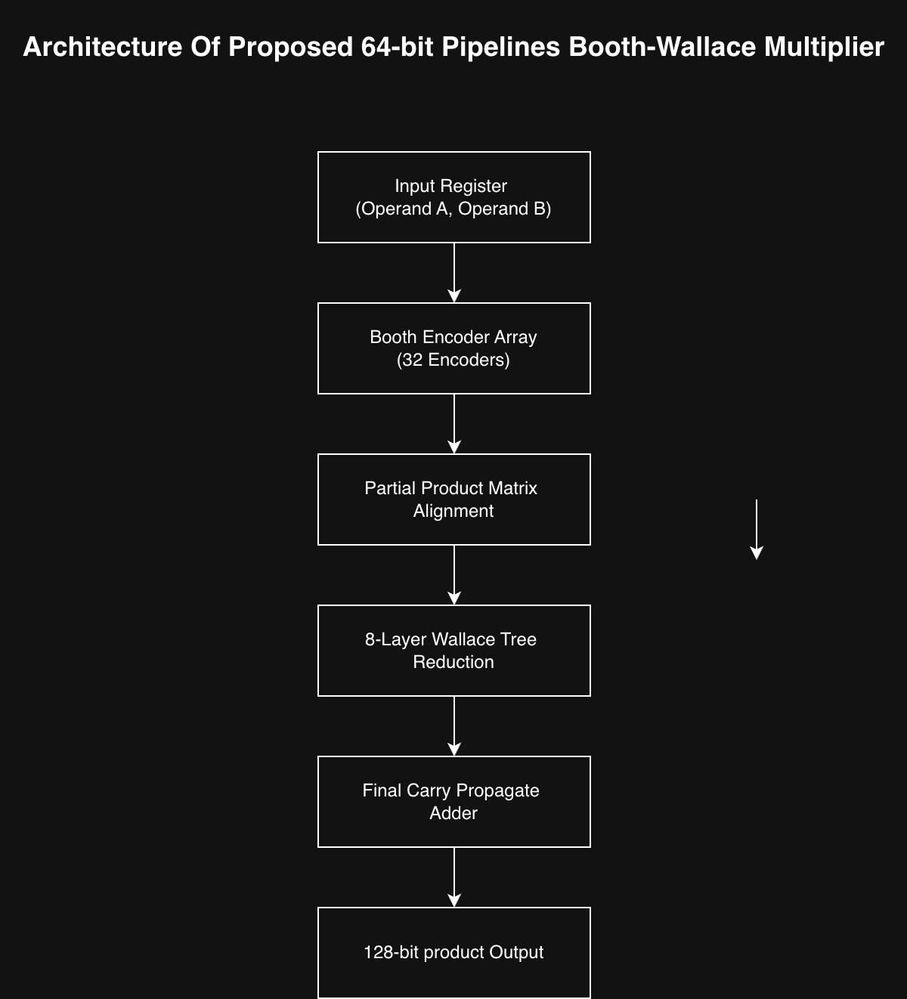
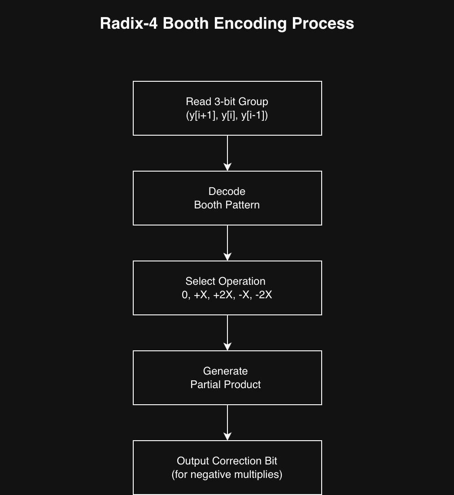
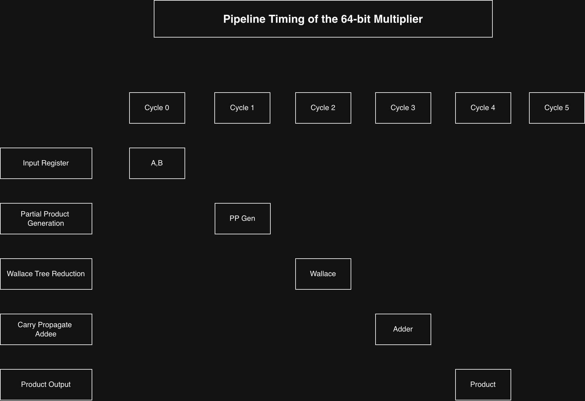
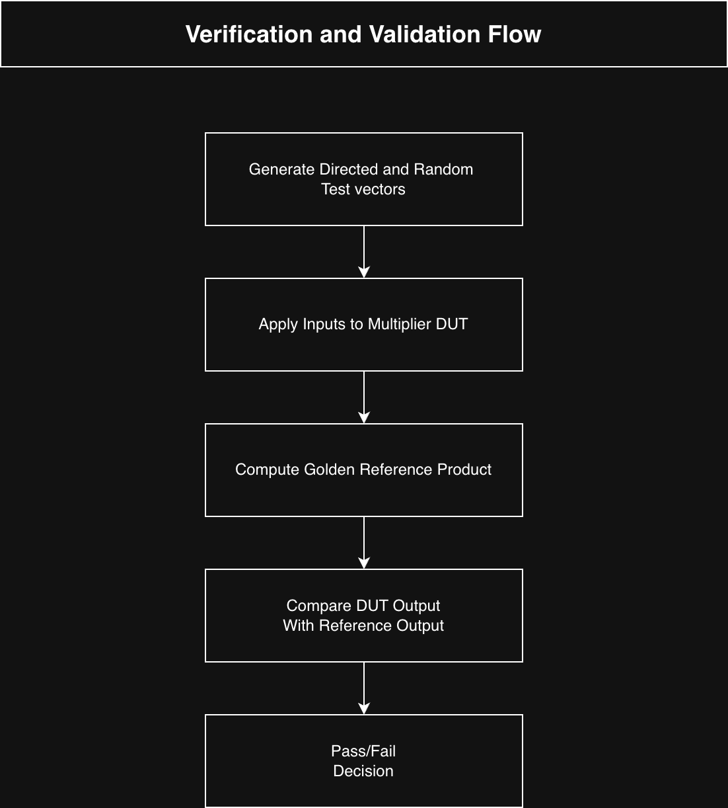

# 64-bit Pipelined Booth Multiplier

Implementation of a 64-bit Booth multiplier using structural SystemVerilog. 

## Project Scope
The design utilizes Radix-4 Booth encoding to generate partial products, structured into a multi-stage pipeline to improve throughput.

## Architecture

### Architecture Diagram



### Booth Encoding Process



### Wallace Tree Reduction


### Pipeline Timing




## Verification
### Verification and Validation Flow



The design was verified using directed test cases and randomized test vectors. A reference multiplication model was used to compare the DUT output against the expected result after pipeline latency alignment.

- **Toolchain:** Icarus Verilog.
- **Methodology:** Testbench verification against known product vectors (e.g., 15 and 120).

### Waveform Results


Waveform capture obtained during simulation showing correct pipeline operation and output generation.


## Synthesis Metrics (Yosys)
The RTL was synthesized using Yosys. Optimization passes effectively reduced the netlist complexity:
- **Redundant Logic:** 14 cells removed.
- **Dead Connectivity:** 570 unused wires stripped.

## Design Notes
- Design targets structural modularity for easy integration into larger arithmetic logic units (ALU).
- Synthesis confirms the design maps to a standard cell library without inferred latches.

## Repository Organization

The repository contains multiple 64-bit multiplier architectures implemented and analyzed independently.

```
64bit-Pipelined-Booth-Multiplier
│
├── Array_Multiplier
│   ├── design.sv.txt
│   ├── Array_Stats.txt
│   ├── run.ys.txt
│   └── Array_Stats_screenshot.png
│
├── Booth_Multiplier
│   ├── design.sv.txt
│   ├── Booth_Stats.txt
│   ├── testbench.sv.txt
│   └── Booth_Stats_screenshot
│
├── Dadda_Multiplier
│   ├── design.sv.txt
│   ├── Dadda_Stats.txt
│   ├── run.ys.txt
│   └── Dadda_Stats_screenshot
│
└── README.md
```

### File Description

Each architecture directory contains:

- **design.sv** – SystemVerilog RTL implementation.
- **output.txt** – Synthesis and simulation output logs.
- **run.ys** – Yosys synthesis script.
- **screenshot.png** – Screenshot showing synthesis and verification results.

### Implemented Architectures

- **Array Multiplier**
- **Radix-4 Booth Multiplier**
- **Dadda Multiplier**
